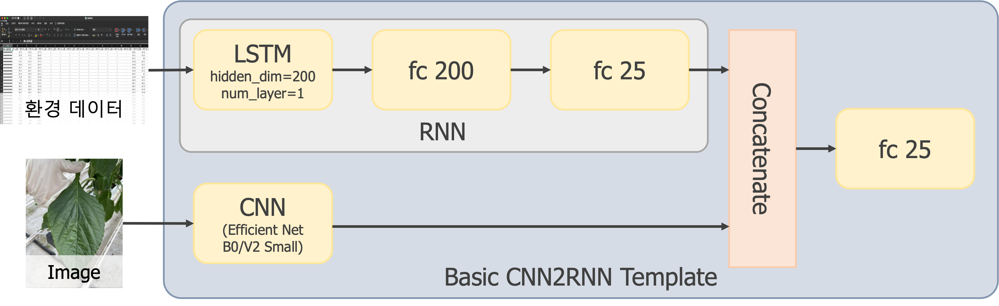
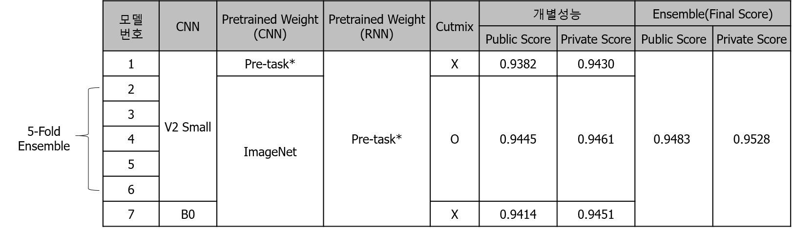
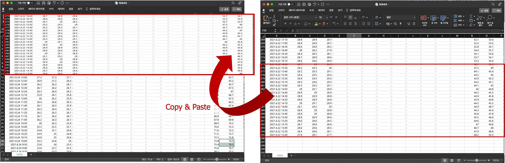

# 농업 환경 변화에 따른 작물 병해 진단 AI 경진대회 ([link](https://dacon.io/competitions/official/235870/overview/description))

## 1. 방법  

저희는 총 7개의 모델을 앙상블하여 최종 결과를 제출하였습니다.  

각 모델의 구조는 다음 그림 모양의 CNN2RNN 큰 틀은 유지하면서,  
다른 CNN 모델을 사용하거나, Data Augmentation 방법을 다르게 하면서 학습하였습니다.  

환경변수 전처리는 DaconBaseLine과 같게 했으며,  
영상 전처리는 많이 쓰는 기법(resize(512 or 528), Flip, Gamma변화, Brightness 변화 등등)과, Cutmix를 사용하였습니다.  

  

7개 모델의 구성은 다음과 같습니다.  

- CNN모델 EfficientNet B0 또는 V2 Small만을 사용하였습니다.  
- CNN의 Pre-task*는 CNN만을 이용하여 작물병해 분류 작업을 학습한 모델의 Weight를 의미합니다.  
- RNN의 Pre-task*는 RNN만을 이용하여 작물병해 분류 작업을 학습한 모델의 Weight를 의미합니다.  
- Cutmix는 영상과 환경변수 데이터에 모두 적용하였습니다.  

  

## 2. 성능향상을 보였던 방법들  

- 가벼운 CNN 모델을 사용할수록 Score가 높게 나왔습니다  
   -> CNN 모델만을 사용하여 작물병해 분류 작업을 수행 시, 무거운 모델의 Score가 높게 나왔습니다. 하지만, CNN2RNN 형태로 학습하면 Score가 낮게 나왔습니다. 
- CNN은 Pre-task* weight를 하지 않고, RNN은 Pre-task* weight를 사용한 경우가 CNN2RNN의 성능이 더 성능이 좋았습니다. 
- Cutmix는 다음과 같이 영상과 환경변수 데이터에 모두 적용하였습니다.
 환경변수에 대한 Cutmix는 다른 환경변수 뒷 부분의 값을 Lamda에 비례하는 크기만큼 Copy하여 원본 환경변수의 맨 앞에 Paste 하는 방식으로 구현하였습니다. 
 코드를 참고 부탁드립니다.  ([link](https://github.com/hyunseoki/LG_plant_disease/blob/21001591a139a729ba2dce83493a2b2ced72cab1/models0/src/trainer.py#L91))
- 환경변수에 대하여 Cutout도 시도해보았는데, Public Score는 감소하여 최종 제출때는 사용하지 않았습니다. 하지만, 확인해보니 Private는 Score는 오히려 증가하였기 때문에 모델 일반화 성능에 도움이 된 것 같습니다. 
- 여러 모델을 앙상블하면 모델 일반화 성능은 올라갑니다.  

  
  

## 3. 개발환경 및 주요 라이브러리 버전  

모델 1 ~ 6 : Windows Server 2019  
모델 7 : Linux 20.04  

python==3.8.5  
numpy==1.21.2  
torch==1.9.0  
timm==0.5.4  
albumentation
pandas  
scikit-learn  
tqdm  

```python
conda env create -f conda_requirements.txt ## 또는,
pip install -r pip_requirements.txt
```

## 4. 학습방법  

- CNN의 Pre-task* 학습법 : models0\train_backbone.sh 실행  
- RNN의 Pre-task* 학습법 : models1\run_categoricalclf_rnn.py 실행 (해당 파일 내 _base_dir을 환경에 맞게 변경 필요)
- 1번 모델 학습법 : models0\train_model0.sh 실행
- 2~6번 모델 학습법 : models0\train_model1.sh 실행
- 7번 모델 학습법 : models1\run_categoricalclf.py 실행 (해당 파일 내 _base_dir을 환경에 맞게 변경 필요)

## 5. 추론방법  

- inference\runner.sh 실행
- inference\runner.sh에서 TEST_DATA_FOLDER 및 LABEL_FN을 환경에 맞게 변경 필요
- 최종 결과 파일은 inference\submission\final_results.csv 파일로 생성
